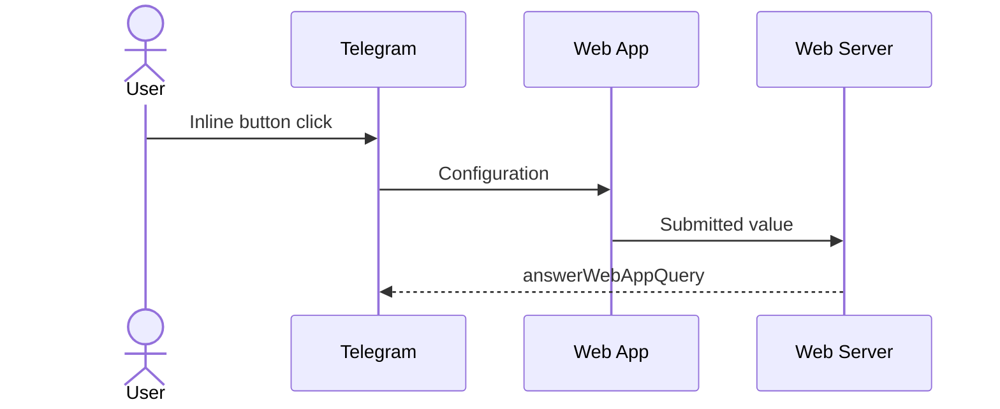

# Telegram web inputs

A collection of configurable web inputs for your Telegram bot.

## Inputs

| Name | Parameters | Submitted value | Based on |
| ---  | --- | --- | --- |
| [Calendar](https://x0k.github.io/telegram-web-inputs/calenar) | [IOptions](https://github.com/uvarov-frontend/vanilla-calendar-pro/blob/629931a96d5b2b07cd2044961ece0d8a35ef657b/package/types.ts#L152) | [Value](https://github.com/uvarov-frontend/vanilla-calendar-pro/blob/629931a96d5b2b07cd2044961ece0d8a35ef657b/docs/en/reference/main/readonly-options.mdx) |[vanilla-calendar-pro](https://github.com/uvarov-frontend/vanilla-calendar-pro) |

## Interaction scheme



## Inputs configuration

All input elements are customizable through the search query parameters:

| Parameter | Description | Type |
| --- | --- | --- |
| `w` | Specific widget parameters | `object` (depends on widget) |
| `v` | Validation schema | `JSONSchema` |
| `r` | Request options | `{ url?: string } & RequestInit` |
| `s` | State | `string` |

## Usage

1. Send a message with the configured inline button.

```shell
export BOT_TOKEN=<your-bot-token>
export CHAT_ID=<your-chat-id>
export HANDLER_URL=<your-handler-url>
export URL="https://x0k.github.io/telegram-web-inputs/calendar?$(python3 -c "
import urllib.parse
import json
from datetime import date
now = date.today().isoformat()
params = {
  'r': json.dumps({
    'url': '${HANDLER_URL}'
  }),
  'v': json.dumps({
    'type': 'object',
    'properties': {
      'selectedDates': {
        'type': 'array',
        'minItems': 1
      }
    },
    'required': ['selectedDates']
  }),
  'w': json.dumps({
    'date': {
      'min': now,
    },
    'settings': {
      'selected': {
        'dates': [now]
      }
    }
  })
}
print(urllib.parse.urlencode(params))
")"
curl -X POST "https://api.telegram.org/bot${BOT_TOKEN}/sendMessage" \
  -H "Content-Type: application/json" \
  -d "$(jq -n --argjson chat_id $CHAT_ID --arg url "$URL" '{
  chat_id: $chat_id,
  text: "Pick a date",
  reply_markup: {
    inline_keyboard: [[
      {
        text: "📅",
        web_app: { url: $url }
      }
    ]]
  }
}')"
```

2. If you not specified the `url` in the request parameters data will be sent via `Telegra.WebApp.sendData` [method](https://core.telegram.org/bots/webapps#initializing-mini-apps).

3. Otherwise the request will be sent via `fetch` with the specified request parameters (`POST`
method by default).

The body of request will be sent in JSON format.

```typescript
{
  /** Submitted value */
  data: unknown
  /** A string with raw data transferred to the Web App, convenient for validating data.
   *  WARNING: Validate data from this field before using it on the bot's server.
   */
  webAppInitData: string
  /** 
   * State query parameter.
   */
  state: string | undefined
}
```

Don't forget to allow `CORS` on your server.

```go
mux.HandleFunc(fmt.Sprintf("OPTIONS %s", endpointPath), func(w http.ResponseWriter, r *http.Request) {
  w.Header().Set("Access-Control-Allow-Origin", "https://x0k.github.io")
  w.Header().Set("Access-Control-Allow-Methods", "POST")
  w.Header().Set("Access-Control-Allow-Headers", "Content-Type")
  w.WriteHeader(http.StatusOK)
})

mux.HandleFunc(fmt.Sprintf("POST %s", endpointPath), func(w http.ResponseWriter, r *http.Request) {
  w.Header().Set("Access-Control-Allow-Origin", "https://x0k.github.io")
  w.Header().Set("Vary", "Accept-Encoding, Origin")
  ...
})
```

## Development

Some ways to work with dev server:

- [VS Code Port forwarding](https://code.visualstudio.com/docs/editor/port-forwarding)
- [Telegram test environment](https://core.telegram.org/bots/webapps#using-bots-in-the-test-environment)
