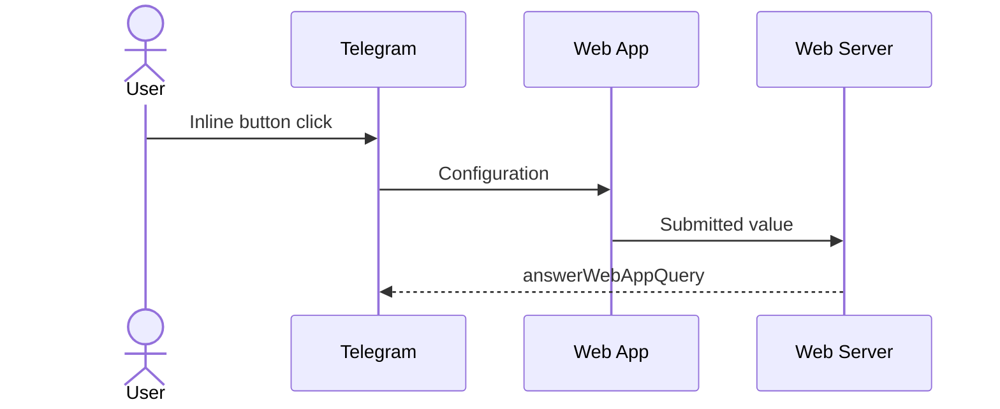

# Telegram web inputs

A collection of configurable web inputs for your Telegram bot.

## Inputs

- Calendar ([vanilla-calendar-pro](https://github.com/uvarov-frontend/vanilla-calendar-pro))

## Interaction scheme

## Inputs configuration

All input elements are customizable through the search query parameters:

- `w` - input specific parameters
- `v` - validation schema
- `r` - request options
- `s` - state

## Development

Some ways to work with dev server:

- [VS Code Port forwarding](https://code.visualstudio.com/docs/editor/port-forwarding)
- [Telegram test environment](https://core.telegram.org/bots/webapps#using-bots-in-the-test-environment)
